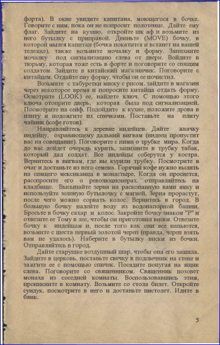
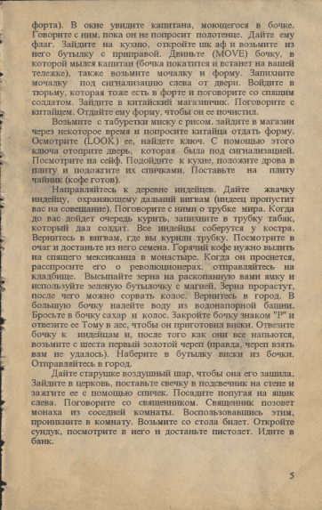
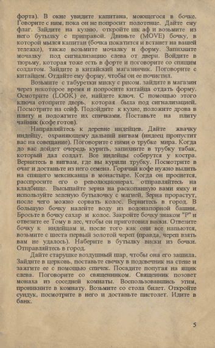
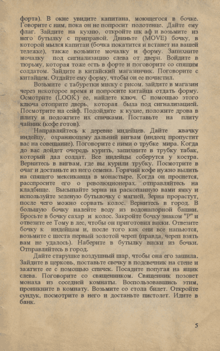
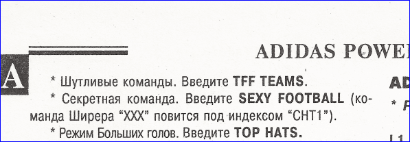

# book-tools

Утилиты для обработки отсканированных страниц книги

## BorderFix

Сканирование страницы редко проходит идеально.
Если у сканера чёрная крышка, то у изображения могут появиться чёрные границы.

А некоторые страницы могут иметь ещё и небольшой наклон, который можно исправить, например, с помощью ImageMagick.
Вот пример кода, который запускается из BAT файла:

```
SET dir="result"
if not exist %dir% mkdir %dir%
for /f %%f in ('dir /b *.bmp') do "C:\Documents and Settings\user\Documents\convert.exe" %%f -filter catrom -deskew 40%% +repage ./%dir%/%%f
```

Пример изображения после такой обработки (белая окантовка плохо видна, поэтому для наглядности добавлена синяя рамка):



BorderFix устраняет белую окантовку, затем чёрные полосы и затем растягивает изображение до требуемых размеров.
Поскольку фон не всегда идеально белый, происходит аккуратное копирование соседнего фона с растягиванием.

### Этапы обработки

После обрезки белых и чёрных полей:

 

После подгонки габаритов и финальный вариант:

 

### Пограничные случаи

BorderFix не подходит для случаев, когда информативная часть примыкает к краю страницы.



В этом случае надо отключать метод fixBlack(), либо, как вариант, можно отключить код, обрезающий эту сторону страницы.
Так же этот метод следует выключать, если у сканера белая крышка.

Поле debug позволяет экспериментировать с картинкой и смотреть все этапы её обработки.

# PaletteOptimize

Это инструмент для оптимизации палитры отсканированных страниц, с целью уменьшения занимаемого места на диске.
Например, если захочется хранить исходники для последующего распознавания текста.

Идея проста - максимально уменьшить количество цветов, в особенности светлого фона, без видимой потери качества.

Исходные данные: отсканированные страницы с градациями одного цвета (белый, светло-коричневый, или любой другой).

**PaletteOptimize работает только с изображениями в BMP формате с палитрой.**

Количество цветов в палитре может быть и 256, и меньше.

Алгоритм обработки следующий:

1. Пакетно преобразовать все страницы в BMP 256 (Irfan View)
2. Оптимизировать палитру с помощью PaletteOptimize
3. Пакетно преобразовать все страницы в PNG с 32 цветами в палитре (Irfan View)

Результирующий размер в 2-3 раза меньше, чем у PNG без аналогичного сжатия.

Результирующий размер соизмерим с JPEG изображеним с качеством 90-95, но при этом в нём не будет искажений, присущих формату JPEG.

Что делает код для каждого цвета в палитре:

* Вычисляет усреднённый цвет по трём каналам
* Приводит цвет к ближайшему доступному
  * Если усреднённый цвет меньше 120, то доступны цвета через 4 (0, 4, 8, ...)
  * Если усреднённый цвет больше 120, то доступны цвета через 8 (120, 128, ...)
* Далее на цвет накладывается оттенок, который был в оригинале.

